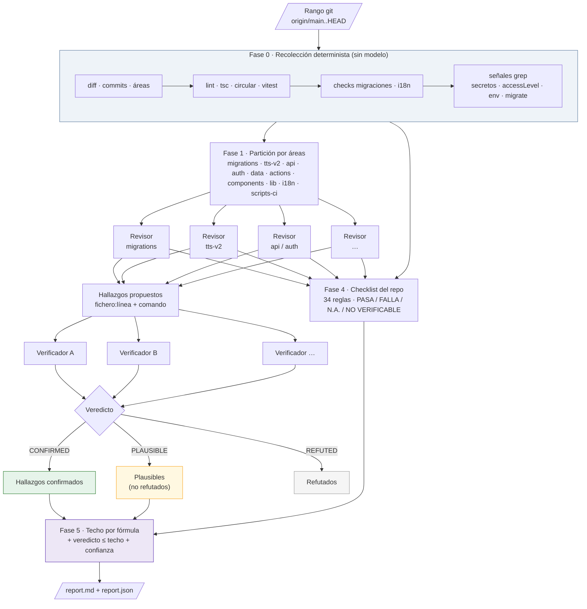

# a2r-release-review

Revisión de release **verificada** para los repositorios de A2R antes de subir a producción
(`main` / `releases`). Sustituye al bot externo de code review: sin coste por uso, sin límite de
ficheros, y con conocimiento de las reglas propias del repo (migraciones Directus, TTS V2,
issues Linear, i18n).

```
/a2r-release-review                  # origin/main..HEAD (lo pendiente de producción)
/a2r-release-review v2.54.0          # desde ese tag hasta HEAD
/a2r-release-review origin/main..origin/develop --skip-tests
```

## Principio

> Nada entra en el informe sin evidencia ejecutada. Lo que no se puede comprobar se declara.

La nota 1-5 tiene dos partes: un **techo calculado** por fórmula a partir de gates, checklist y
hallazgos confirmados, y un **veredicto del revisor** que siempre es ≤ techo. El modelo puede
bajar la nota, nunca subirla.

## Flujo



## Fases

| # | Fase | Quién | Qué produce |
|---|---|---|---|
| 0 | Recolección | `assets/collect.sh` | `meta.json`, diff, commits sin `A2R-nnn`, resultado de lint/tsc/circular/vitest, checks de migraciones, paridad i18n de claves nuevas, señales por grep |
| 1 | Partición | orquestador | un lote por área (≤25 ficheros) |
| 2 | Revisión | subagentes en paralelo, uno por área | hallazgos con `fichero:línea`, `claim` y `evidence_cmd`; checklist de su área |
| 3 | Verificación adversaria | subagentes distintos de los revisores | `CONFIRMED` / `REFUTED` / `PLAUSIBLE` con los comandos ejecutados |
| 4 | Checklist | orquestador + revisores | 34 reglas de `references/checklist.md` con evidencia |
| 5 | Nota | fórmula de `references/rubric.md` + veredicto | techo, nota, confianza |
| 6 | Informe | plantilla `assets/report.template.md` | `report.md` y `report.json` fuera del repo |

## Escala

| Nota | Lectura para el equipo |
|---|---|
| 5 | Sube. Nada confirmado, gates verdes, checklist limpia. |
| 4 | Sube con los menores anotados en la issue de release. |
| 3 | Sube solo tras corregir o aceptar explícitamente lo mayor. |
| 2 | No sube. Bloqueante confirmado o gate rojo. |
| 1 | No sube. Riesgo de tenant, datos o seguridad. |

## Límites

- Solo lectura: no edita, no commitea, no ejecuta `pnpm run migrate`, no toca ningún Directus.
- Certifica la ausencia de los fallos que sabemos nombrar, no la ausencia de fallos. No sustituye
  a los tests.
- Lo que no se puede verificar en local (permisos reales con rol `Default`, orden de despliegue
  frente a `nimrod-api`, efecto sobre datos de cada tenant) se lista siempre en «No verificable».

## Camino a CI

La entrada (rango) y la salida (`report.json`) son el contrato para una GitHub Action con
`claude -p` sobre PR a `main` y tag `v*`. Los cambios de reglas van a `references/checklist.md`
y `references/rubric.md`, nunca al prompt suelto.
