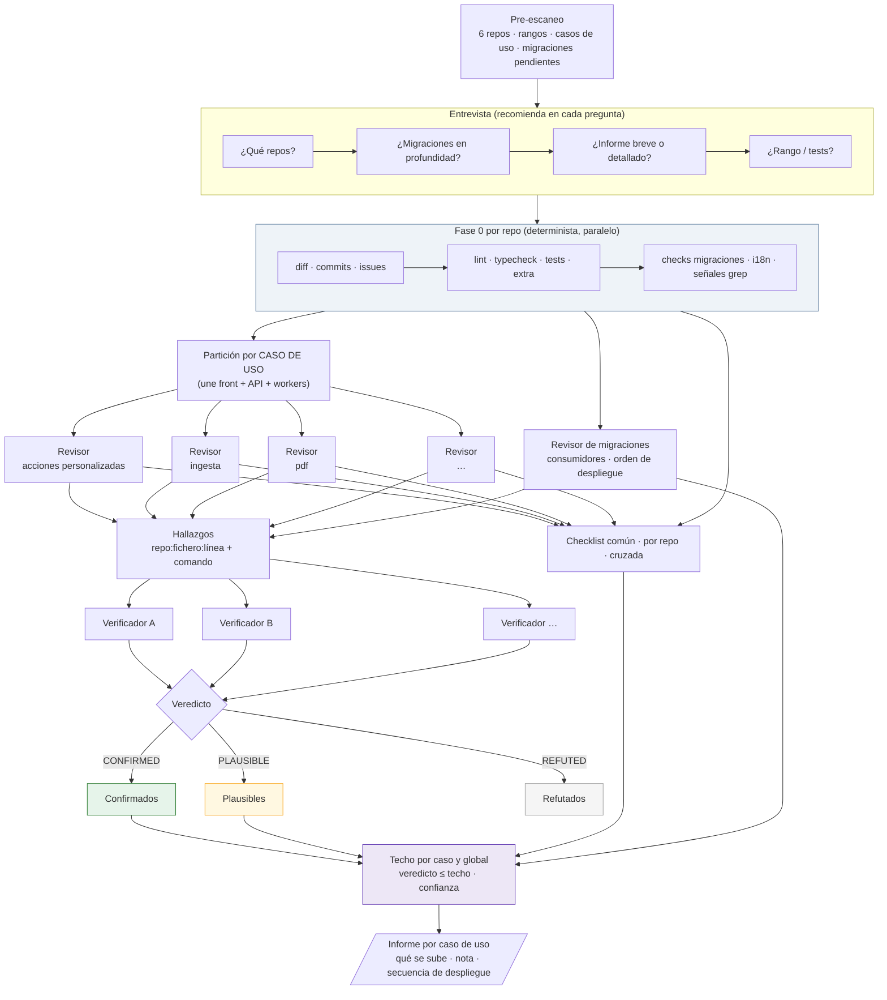

# a2r-release-review

Revisión de release **conversacional, verificada y orientada a casos de uso** para los seis repos
que A2R despliega: `nimrod-multitenant`, `nimrod-api`, `semantic-pdf-serverless`, `pdf-remediation`,
`translate-documents` y `bulk-url-process`. Sustituye al bot externo de code review: sin coste por
uso, sin límite de ficheros, y con las reglas propias de cada repo (migraciones Directus, TTS V2,
timeouts de workers, contratos cruzados entre front, API y workers).

```
/a2r-release-review                                  # pre-escaneo + entrevista
/a2r-release-review --repos nimrod-multitenant,nimrod-api --migrations --depth detallado
/a2r-release-review --yes                            # modo CI: sin preguntas, recomendaciones del pre-escaneo
```

## Principio

> Nada entra en el informe sin evidencia ejecutada. Lo que no se puede comprobar se declara.

La nota 1-5 se calcula por caso de uso y global: un **techo** por fórmula (gates, checklist,
hallazgos confirmados) y un **veredicto** del revisor siempre ≤ techo.

## Flujo



## Fases

| # | Fase | Quién | Qué produce |
|---|---|---|---|
| 0 | Pre-escaneo | `assets/prescan.sh` | por repo: rango pendiente, commits, ficheros, migraciones, casos de uso; recomendación de profundidad |
| 1 | Entrevista | `AskUserQuestion` | repos, migraciones sí/no, breve/detallado, rango, tests; cada opción con dato y recomendación |
| 2 | Recolección | `assets/collect.sh` por repo | `meta.json`, gates, señales, `usecases.tsv`, contratos Directus |
| 3 | Partición | orquestador | un lote por caso de uso cruzando repos |
| 4 | Revisión | subagente por caso (+ revisor de migraciones) | hallazgos con evidencia, consistencia cruzada, «qué se sube» |
| 5 | Verificación | subagentes distintos | CONFIRMED / REFUTED / PLAUSIBLE |
| 6 | Checklist | orquestador + revisores | reglas comunes, por repo y cruzadas |
| 7 | Nota | `references/rubric.md` | techo por caso y global, veredicto, confianza |
| 8 | Informe | `assets/report.template.md` | breve o detallado, por caso de uso; `report.json` |

## Casos de uso

Los 14 de la etiqueta «Caso de uso» de Linear, con owner: TTS-STT, Traducciones, Ingesta,
Acciones personalizadas, Chatbots, Revisión de estilo, PDF, Evaluaciones, Generación de preguntas,
Imágenes, Dashboard, Auth, SDC (sin código en estos repos) y Transversal (`plataforma`). Los globs
por repo viven en `references/use-cases.json`; los workers enteros pertenecen a un caso
(semantic-pdf y bulk-url → Ingesta, pdf-remediation → PDF, translate-documents → Traducciones).

## Escala

| Nota | Lectura |
|---|---|
| 5 | Sube. Nada confirmado, gates verdes, checklist limpia. |
| 4 | Sube con los menores anotados en la issue de release. |
| 3 | Sube tras corregir o aceptar lo mayor, con el orden de despliegue escrito. |
| 2 | No sube. Bloqueante confirmado o gate rojo. |
| 1 | No sube. Riesgo de tenant, datos, seguridad o migración peligrosa. |

## Secretos

Un informe de release circula por Slack, Linear y a veces por un artefacto compartido, así que
**nunca lleva el valor de una credencial**. Tres capas lo garantizan:

1. **La recolección no los guarda.** `assets/scanSecrets.mjs` recorre las líneas añadidas y escribe
   solo `fichero:línea · tipo · huella · longitud`. La huella son cuatro hexadecimales de SHA-256:
   sirve para ver si la misma credencial aparece en dos sitios, y no revela nada.
2. **Los revisores no los citan.** Los prompts obligan a demostrar la existencia con `grep -c` o
   `grep -o` del nombre de la variable, nunca con un comando que imprima la línea.
3. **El redactor es la última red.** `assets/redact.mjs` pasa por encima de `report.md` y
   `report.json` y enmascara claves de OpenAI, Anthropic, OpenRouter, ElevenLabs, GitHub, Slack,
   Google y AWS, JWT, cabeceras `Bearer`, claves privadas, URL con contraseña y asignaciones a
   variables cuyo nombre contiene token, secret, password o api key. Distingue marcadores de ejemplo
   (`your-token-here`, `changeme`) e identificadores (`x-ratelimit-remaining-tokens`). Sale con
   código 3 si tuvo que enmascarar algo, y eso se trata como un fallo de la revisión, no como una
   salvaguarda que funcionó.

El informe reporta la credencial por lo que es: «clave de OpenAI en claro en
`deploy/config/template_pro.json:48`, huella #7dfb, preexistente, rotar». Los artefactos de fase 0
(`diff.patch`, `added-lines.txt`) contienen el diff en crudo, se quedan en local y no se publican.

## Límites

- Solo lectura en todos los repos. Nunca ejecuta migraciones ni toca Directus.
- Certifica la ausencia de los fallos que sabemos nombrar, no la ausencia de fallos.
- No verificable en local, y así se declara: permisos reales con rol `Default`, efecto de una
  migración sobre datos de cada tenant, que la imagen de un worker se haya publicado.

## Camino a CI

`--yes` desactiva la entrevista y aplica las recomendaciones. El contrato es repos y rangos de
entrada y `report.json` de salida, para una GitHub Action con `claude -p` sobre PR a `main` y tag
`v*`. Reglas en `references/`, nunca en el prompt suelto.
